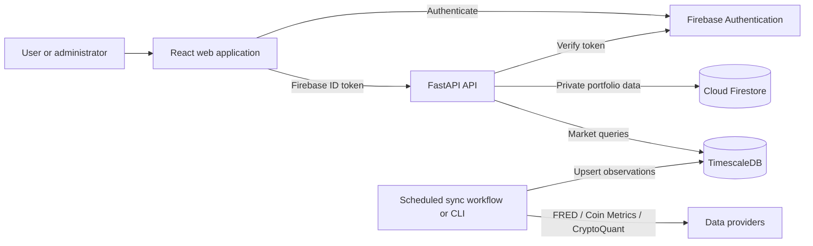

<div align="center">

# Macroverse

**Portfolio intelligence, trade journaling, and market research in one analytical workspace.**

[](https://github.com/mocaales/macroverse/actions/workflows/ci.yml)
[](https://sonarcloud.io/summary/new_code?id=mocaales_macroverse)
[](https://sonarcloud.io/component_measures?id=mocaales_macroverse&metric=coverage)

[Documentation](docs/README.md) · [Architecture](docs/architecture.md) · [Development](docs/development.md) · [Deployment](docs/deployment.md) · [API](docs/api.md)

</div>

---

Macroverse is a full-stack financial analytics application. It combines authenticated portfolio management with a trade journal, performance analytics, and durable macroeconomic and cryptocurrency time-series data.

## Capabilities

- Manage trading, investing, banking, and aggregate portfolio accounts.
- Record trades, deposits, withdrawals, and investment holdings.
- Calculate balance history, realised P&L, win rate, average trade, and position risk.
- Explore FRED and Bitcoin market datasets through interactive charts.
- Authenticate users with Firebase Authentication.
- Assign one configured account as administrator and provide user-account management.
- Persist private user data in Cloud Firestore and shared market data in TimescaleDB.
- Synchronize provider data incrementally through scheduled GitHub Actions or manual CLI runs.

## Technology

| Layer | Technology |
| --- | --- |
| Web application | React 19, TypeScript, Vite, TanStack Query, Plotly |
| API | Python 3.13, FastAPI, Pydantic |
| Identity | Firebase Authentication and Firebase Admin SDK |
| User data | Cloud Firestore |
| Market data | PostgreSQL with TimescaleDB |
| Delivery | Docker, Nginx, Render, GitHub Container Registry |
| Quality | Pytest, Vitest, Ruff, ESLint, SonarQube Cloud |

## System Overview



The backend is the only component allowed to access Firestore documents. Browser requests carry Firebase ID tokens, which FastAPI verifies before resolving a user-specific document path. Market data is stored separately because it is shared, append-oriented time-series data.

See [Architecture](docs/architecture.md) for component, sequence, activity, and data-model diagrams.

## Quick Start

### Prerequisites

- Docker Desktop with Docker Compose
- A Firebase project with Email/Password authentication enabled
- Firebase web application configuration
- A Firebase service account for backend access
- A FRED API key

### Start with Docker

```bash
cp .env.example .env
```

Complete the values in `.env`, including PostgreSQL credentials, Firebase configuration, and `FRED_API_KEY`. Encode the Firebase service account for Docker:

```bash
base64 < /absolute/path/firebase-service-account.json | tr -d '\n'
```

Set the result as `FIREBASE_SERVICE_ACCOUNT_BASE64`, then start the stack:

Set `ADMIN_EMAIL` to the sole Firebase account that may access the administration panel. Every other registered account is assigned the `user` role.

```bash
make docker-up
```

| Service | URL |
| --- | --- |
| Web application | http://localhost:8080 |
| OpenAPI documentation | http://localhost:8000/api/docs |
| API health | http://localhost:8000/api/v1/health |
| Market database health | http://localhost:8000/api/v1/health/market |

Stop the application without deleting database data:

```bash
make docker-down
```

For native development, Firebase setup, and database initialization, follow the [Development Guide](docs/development.md).

## Repository Layout

```text
macroverse/
├── frontend/                 React and TypeScript web application
├── backend/
│   ├── app/                  FastAPI application and worker
│   ├── migrations/           TimescaleDB schema migrations
│   ├── tests/                Backend unit and integration tests
│   └── legacy_streamlit/     Previous implementation, reference only
├── docs/                     Architecture and operational documentation
├── .github/workflows/        CI, release, and market synchronization
├── docker-compose.yml        Local application stack
├── render.yaml               Render deployment blueprint
├── firestore.rules           Deny-by-default Firestore client rules
└── sonar-project.properties  SonarQube analysis configuration
```

## Quality

Run the complete local quality gate:

```bash
make quality
```

This runs backend and frontend linting, tests with coverage, and the production frontend build. Coverage thresholds are enforced in both projects.

GitHub Actions additionally validates TimescaleDB migrations, builds both container images, and submits coverage-aware analysis to SonarQube Cloud.

## Documentation

| Document | Purpose |
| --- | --- |
| [Documentation index](docs/README.md) | Navigation and ownership |
| [Architecture](docs/architecture.md) | Components, data flows, decisions, and diagrams |
| [Development](docs/development.md) | Environment setup, commands, and testing |
| [API reference](docs/api.md) | Authentication, endpoints, and examples |
| [Deployment](docs/deployment.md) | Firebase, Tiger Cloud, Render, and release flow |
| [Operations](docs/operations.md) | Market sync, migrations, monitoring, and recovery |
| [Security](docs/security.md) | Trust boundaries, secrets, CORS, and data protection |

## Contributing

Read [CONTRIBUTING.md](CONTRIBUTING.md) before opening a pull request. Security reports should follow [SECURITY.md](SECURITY.md).
