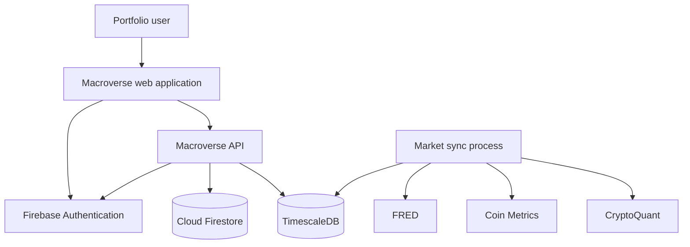
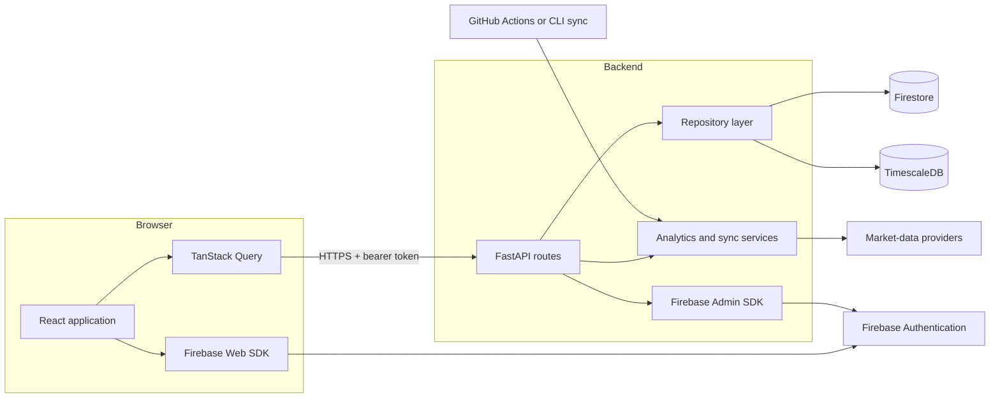
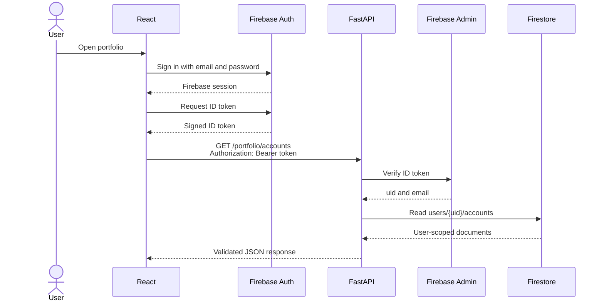
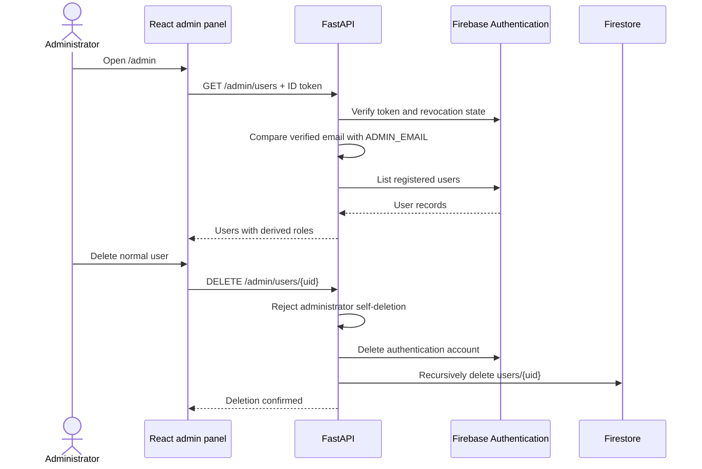
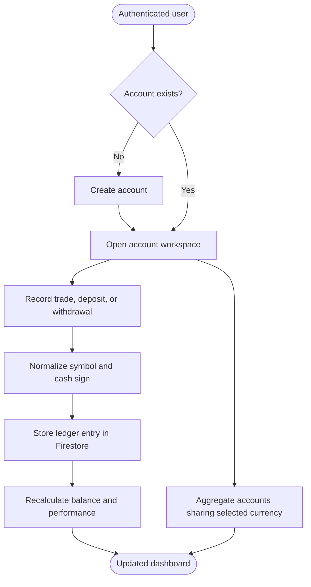
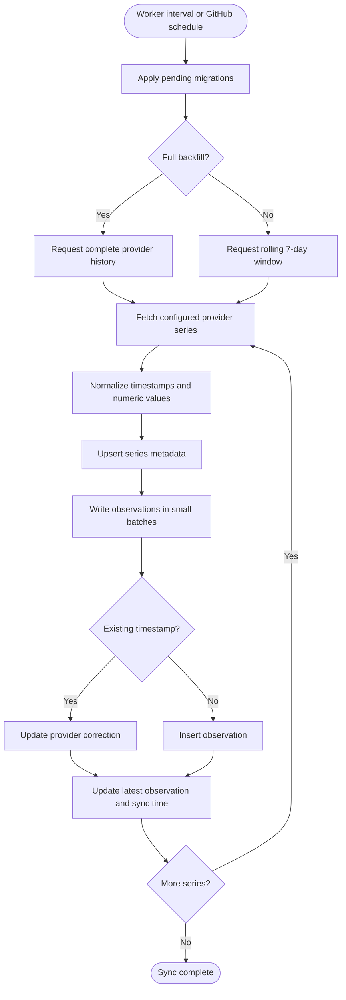
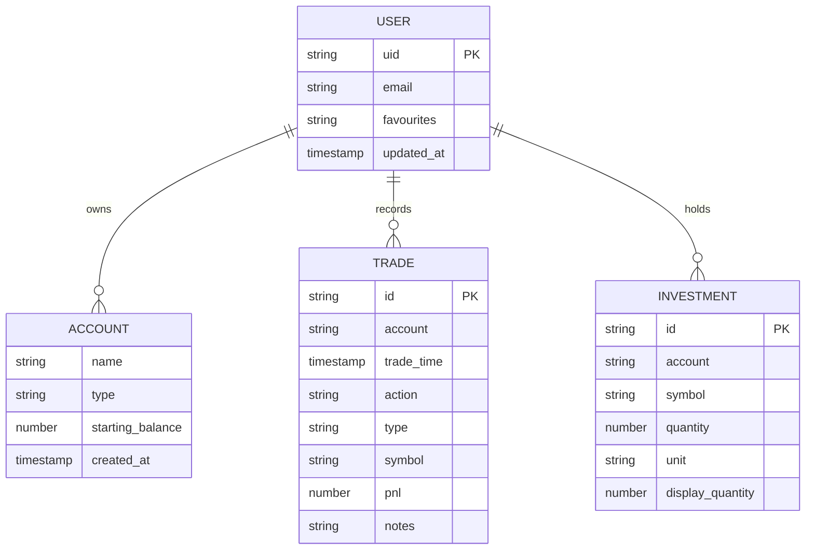
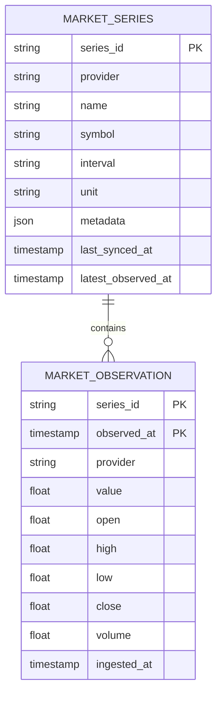

# Architecture

## Architectural Goals

Macroverse separates interactive portfolio workflows from shared market-data ingestion:

- The browser owns presentation and Firebase sign-in.
- FastAPI owns authorization, validation, analytics, and persistence orchestration.
- FastAPI derives the sole administrator role from the verified Firebase email.
- Firestore stores private, user-scoped application data.
- TimescaleDB stores shared market observations optimized for time-range queries.
- Provider ingestion runs outside request handling so external latency does not block normal application traffic.
- Chart requests read only persisted observations; provider APIs are never called in the browser request path.

## System Context



## Container View



Backend packages follow a layered dependency direction:

```text
api -> services -> repositories -> infrastructure
 |         |             |
 models <-+-------------+
```

Routes translate HTTP requests into domain operations. Services contain calculations and provider synchronization. Repositories isolate Firestore and PostgreSQL behavior. Core modules construct external clients from environment configuration.

## Authenticated Request Sequence



The immutable Firebase `uid`, not an email supplied by the browser, determines the Firestore document path.

## Role Model

Macroverse has two roles:

| Role | Assignment | Access |
| --- | --- | --- |
| `admin` | Verified Firebase email equals `ADMIN_EMAIL` | Standard application and user administration |
| `user` | Every other Firebase account | Standard application only |

Roles are derived for each authenticated request and are not accepted from the frontend or stored as editable Firestore profile data. The admin navigation is a presentation convenience; FastAPI remains the authorization boundary.

## User Administration Sequence



## Portfolio Activity



Account balances are never added across unlike currencies. The frontend automatically requests and displays a separate aggregate for every currency represented by the user's accounts; FX conversion can be added later without corrupting historical totals.

## Market Synchronization Activity



## Data Model

### Firestore



All documents are nested under `users/{firebaseUid}`. Firestore client rules deny direct browser access; the backend uses Firebase Admin IAM.

Portfolio data is stored in these Firestore paths:

- `users/{firebaseUid}/accounts/{accountId}` for trading accounts
- `users/{firebaseUid}/ledger_entries/{transactionId}` for deposits, withdrawals, and trades
- `users/{firebaseUid}/trades/{transactionId}` for legacy ledger entries retained during migration
- `users/{firebaseUid}/investments/{investmentId}` for investment positions

### TimescaleDB



`market_observations` is a TimescaleDB hypertable keyed by series and observation time.

## Key Decisions

| Decision | Rationale |
| --- | --- |
| Firebase Auth with backend token verification | Managed identity without trusting browser-provided user identifiers |
| Server-derived single administrator | Prevents privilege selection at signup and keeps authorization out of browser state |
| Firestore for portfolio documents | Natural user-scoped document model and low operational overhead |
| TimescaleDB for market observations | Efficient time-series storage, range queries, and PostgreSQL compatibility |
| Repository boundary | Keeps route and service code independent of persistence SDK details |
| Rolling seven-day ingestion | Captures late provider corrections while avoiding expensive full-history reads |
| Database-only chart reads | Keeps request latency predictable and separates provider availability from production chart access |
