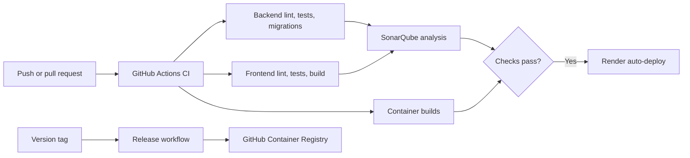

# Deployment Guide

## Production Topology

The supported production layout is:

- React static site on Render
- FastAPI Docker service on Render
- Firebase Authentication and Cloud Firestore
- Tiger Cloud managed TimescaleDB
- GitHub Actions for CI, scheduled synchronization, and container releases



## Firebase

Production requires:

- Email/Password authentication enabled
- A registered web application
- Firestore created in production mode
- `firestore.rules` deployed
- Render frontend domains added under **Authentication > Settings > Authorized domains**

The web configuration is public application metadata. The service-account credential is private and belongs only in the backend environment.

## Tiger Cloud

1. Create a PostgreSQL/Timescale service near the Render region.
2. Copy the TLS-enabled connection string.
3. Store it as `MARKET_DATABASE_URL`.
4. Keep database ingress restricted where operationally possible.
5. Run migrations before serving application traffic.

`render.yaml` runs:

```bash
python -m app.cli migrate
```

as the API pre-deploy command.

## Render Blueprint

Create a Render Blueprint from the repository root. The committed `render.yaml` defines:

- `macroverse-api`, built from `backend/Dockerfile`
- `macroverse-web`, built as a React static site

### Backend environment

| Variable | Required | Notes |
| --- | --- | --- |
| `ENVIRONMENT` | Yes | Set to `production` |
| `CORS_ORIGINS` | Yes | Exact HTTPS frontend origins, comma-separated |
| `FIREBASE_PROJECT_ID` | Yes | Firebase project identifier |
| `FIREBASE_SERVICE_ACCOUNT_BASE64` | Yes | Base64 service-account JSON |
| `MARKET_DATABASE_URL` | Yes | Tiger Cloud URL with TLS |
| `FRED_API_KEY` | Yes | FRED access key |
| `CRYPTOQUANT_ACCESS_TOKEN` | Optional | Required only for configured CryptoQuant series |
| `CRYPTOQUANT_SERIES_JSON` | Optional | Single-line JSON array |

### Frontend build environment

| Variable | Purpose |
| --- | --- |
| `VITE_API_URL` | Production API URL ending in `/api/v1` |
| `VITE_FIREBASE_API_KEY` | Firebase web API key |
| `VITE_FIREBASE_AUTH_DOMAIN` | Firebase authentication domain |
| `VITE_FIREBASE_PROJECT_ID` | Firebase project identifier |
| `VITE_FIREBASE_STORAGE_BUCKET` | Firebase storage bucket |
| `VITE_FIREBASE_MESSAGING_SENDER_ID` | Firebase sender identifier |
| `VITE_FIREBASE_APP_ID` | Firebase web application identifier |

Use exact HTTPS origins and omit trailing slashes:

```dotenv
CORS_ORIGINS=https://macroverse-web.onrender.com
VITE_API_URL=https://macroverse-api.onrender.com/api/v1
```

## GitHub Configuration

### Secrets

| Secret | Used by |
| --- | --- |
| `SONAR_TOKEN` | SonarQube analysis |
| `MARKET_DATABASE_URL` | Scheduled market sync |
| `FRED_API_KEY` | Scheduled market sync |
| `CRYPTOQUANT_ACCESS_TOKEN` | Optional market sync |
| `CRYPTOQUANT_SERIES_JSON` | Optional market sync |
| `CI_POSTGRES_HOST` | CI TimescaleDB |
| `CI_POSTGRES_PORT` | CI TimescaleDB |
| `CI_POSTGRES_DB` | CI TimescaleDB |
| `CI_POSTGRES_USER` | CI TimescaleDB |
| `CI_POSTGRES_PASSWORD` | CI TimescaleDB |

### Variables

- `SONAR_HOST_URL`
- `SONAR_PROJECT_KEY`
- `SONAR_ORGANIZATION`
- `MARKET_DATABASE_BATCH_SIZE`
- Firebase `VITE_*` build values used by container releases
- `VITE_API_URL`

## Release Workflow

Push a semantic version tag to publish frontend and backend images:

```bash
git tag v1.1.0
git push origin v1.1.0
```

The release workflow publishes versioned, major/minor, latest, and commit-SHA tags to GitHub Container Registry.

## Deployment Verification

After deployment:

```bash
curl https://<api-domain>/api/v1/health
curl https://<api-domain>/api/v1/health/market
```

Then verify:

1. The frontend loads over HTTPS.
2. Firebase sign-in succeeds on the production domain.
3. An authenticated account request succeeds.
4. Chart series return stored observations.
5. Render health checks and GitHub scheduled syncs remain green.

