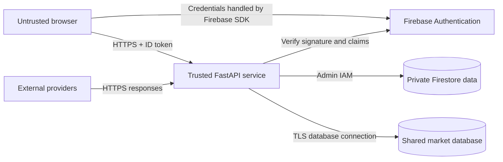

# Security Architecture

## Trust Boundaries



The browser is not trusted to provide a user identifier or access Firestore directly.

## Authentication and Authorization

- Firebase Authentication stores credentials and manages sessions.
- FastAPI verifies every protected request, including token revocation, with Firebase Admin.
- Firestore paths are derived from the verified `uid`.
- Firestore client rules deny all browser reads and writes.
- A `401` response causes the frontend to clear the current Firebase session.
- The backend derives the role from the verified email and `ADMIN_EMAIL`; browser role values are never trusted.
- Exactly one configured email receives the `admin` role. All other accounts receive the `user` role.
- Admin routes independently enforce authorization and prevent deletion of the active administrator account.

## Secret Classification

### Private

- Firebase service-account JSON or its base64 representation
- PostgreSQL passwords and connection URLs
- FRED and CryptoQuant tokens
- SonarQube token
- CI database credentials

Store private values in local ignored `.env` files, GitHub Actions secrets, or Render secret environment variables.

### Public application configuration

Firebase web `VITE_*` values identify the Firebase web application but do not grant administrative access. They may be injected at build time. Security still depends on Firebase Authentication, backend token verification, IAM, and Firestore rules.

## CORS

The backend has no trusted origins by default. `CORS_ORIGINS` must be explicitly configured:

```dotenv
CORS_ORIGINS=https://app.example.com
```

Use comma-separated exact origins when multiple domains are active. Production origins must use HTTPS. Do not use `*` with credentialed requests.

## Transport Security

- Render and Firebase endpoints must use HTTPS.
- Tiger Cloud connections should use the TLS-enabled connection string.
- HTTP localhost origins exist only in local environment templates.
- Production secrets must never be placed in frontend variables or container build arguments.

## Data Protection

- Portfolio documents are user-scoped in Firestore.
- Deleting a user removes the Firebase Authentication account and recursively removes its Firestore user document.
- Market data is shared and contains no user credentials.
- Passwords are never stored by Macroverse.
- Logs should not contain bearer tokens, service-account data, database URLs, or request bodies with private financial notes.
- Backups inherit the sensitivity of their source data and require restricted access.

## Dependency and Code Review

CI performs:

- Python and TypeScript linting
- Unit and integration tests with enforced coverage
- Production builds
- Container builds
- SonarQube reliability, maintainability, and security analysis

Security hotspots require human review even when the quality gate passes.

## Security Checklist

Before production deployment:

1. Deploy `firestore.rules`.
2. Configure exact HTTPS CORS origins.
3. Add production domains to Firebase Authorized domains.
4. Rotate any credential previously exposed in logs or Git history.
5. Use TLS for the market database.
6. Restrict GitHub, Render, Firebase, and Tiger Cloud membership.
7. Verify health endpoints reveal no sensitive configuration.
8. Confirm `.env` and service-account files are not tracked.
9. Confirm `ADMIN_EMAIL` matches the intended Firebase account and that no second account has administrative access.

Report vulnerabilities according to the root [Security Policy](../SECURITY.md).
